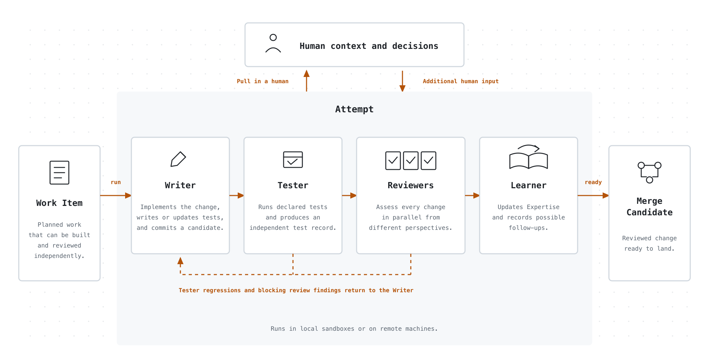

# Fluent – a self improving software factory

Fluent is a factory that autonomously turns your team's vision, ideas, bug reports, user feedback, production logs, and agent traces into working software.

<p align="center">
  <picture>
    <source media="(prefers-color-scheme: dark)" srcset=".github/assets/fluent-at-a-glance-dark.gif">
    <source media="(prefers-color-scheme: light)" srcset=".github/assets/fluent-at-a-glance-light.gif">
    
  </picture>
</p>

You use the factory through the Fluent [skill](https://agentskills.io/) in Codex, Claude Code, Pi, or another coding agent that supports skills. The skill turns your conversation into Fluent's interface and drives its command-line machinery for you.

### Install

```bash
npx skills add mrinalwadhwa/fluent --skill fluent  # currently macOS only
```

Use the command above to install the Fluent skill. Start your coding agent in the project folder you want Fluent to work on, then ask it to use Fluent and describe what you want to explore, build, fix, or improve.

The first invocation sets up Fluent for that project and starts shaping the work with you. You can also invoke the skill explicitly: `$fluent` in Codex, `/fluent` in Claude Code, or `/skill:fluent` in Pi.

## How Fluent works

Fluent separates work that needs human attention from work agents can do on their own. You can think of it as two conceptual queues. The first queue waits for people with the right context, judgment, expertise, or authority. The second waits on both compute and agent capacity: a suitable environment with the models, tools, and hardware the work needs, and room to run an agent within subscription, rate, and budget limits.

<p align="center">
  <picture>
    <source media="(prefers-color-scheme: dark)" srcset=".github/assets/fluent-overall-flow-dark.png">
    <source media="(prefers-color-scheme: light)" srcset=".github/assets/fluent-overall-flow-light.png">
    
  </picture>
</p>

Whenever you encounter something to explore, build, fix, or improve, ask Fluent to record it as an Observation. Add whatever context you have in the moment; you do not need to know the solution or have worked out every detail. Agents and connected systems can record Observations too. You can return to any Observation later and refine it on your own timeline, bringing in someone with the right expertise or authority when needed.

When you want to act on an Observation, ask Fluent to shape it into a Work Item, then ask it to run the Work Item. The Work Item waits until suitable agent and compute capacity is available. If its Attempt needs human context or a decision, Fluent places the question in the human queue and releases the capacity it was using, allowing other ready Work to continue.

## How you tell Fluent what to build

Ask Fluent to help shape what you want to build. You can start from an Observation you recorded earlier or begin directly with a Brief. Fluent reads the relevant project code along with the reusable conventions, constraints, and lessons captured as project Expertise.

You do not need to arrive with a finished specification. Fluent collaborates with you as the slice takes shape. It grounds the conversation in the code and project Expertise, checks that it understands what you mean, and asks one focused question at a time. It uses structured methods for problem framing, behavior design, architecture, and planning to challenge assumptions, find missing cases, research technical choices, and present options with their tradeoffs. You provide context and judgment and make each decision.

The conversation produces four layers of shared context:

**Brief.** A Brief describes one small slice of functionality. Fluent is designed to help you turn that slice into working software without first specifying the entire system. The Brief captures, in your words, what you want and why, grounded in the relevant project context. It keeps constraints, assumptions, and unknowns explicit without choosing a solution.

**Behavior Specifications.** A Behavior Specification precisely describes how the software must behave in a particular situation. It is written so the specified observable behavior can be verified without prescribing its implementation.

For the slice described in the Brief, Fluent reads the project’s existing Behavior Specifications and relevant code to understand what the software already guarantees. It then works with you to define the additions, changes, or removals needed for that slice. The result is a behavior diff, not a restatement of the entire system. If the project has no existing Behavior Specifications, the first slice starts them.

Before writing Behavior Specifications, Fluent makes the important terms precise and maps the people and systems involved, the events that occur, and the states that matter. For a small slice, it considers only what changes. It works through one area at a time, proposing a few core behaviors before asking about gaps and important edge cases. If Fluent derives a behavior that was not stated in the Brief, it labels the behavior as derived so you can accept or reject it. Decisions about libraries, protocols, storage, and other solution choices wait for the Technical Approach.

Fluent writes each Behavior Specification in a consistent form that names the situation and the required response. For example:

```text
WHEN a user selects Save on a draft,
THE SYSTEM SHALL show a `Saved` status beside the draft title.
Test: tests/drafts.spec.ts (shows_saved_status_after_save)
```

It describes something a person can observe and a test can verify, without choosing a UI framework, component structure, or persistence mechanism.

Fluent writes Behavior Specifications in EARS, the Easy Approach to Requirements Syntax. EARS uses a small set of patterns that make the triggering event or condition and the required response explicit.

Every new behavior includes either a `Test:` reference or an `Untestable:` reason. While defining the behavior, Fluent inspects nearby tests and names the intended test in the project’s existing style. The test usually does not exist yet. The Writer creates it during implementation and the Tester runs it. When the test passes, the Behavior Reviewer uses that as evidence that the behavior was delivered.

**Technical Approach.** The Technical Approach document captures your technical expertise and judgment before the work is delegated to agents. You and Fluent decide the key technical choices that should guide implementation, including structure, interfaces, protocols, libraries, storage, and integrations. The document gives the Writer both the decisions and the reasoning behind them, while leaving implementation details that agents can safely determine during the work.

**Implementation Plan.** The Implementation Plan turns the confirmed behaviors and technical decisions into work that agents can carry out. You and Fluent decide whether the slice should become one Work Item or several independently reviewable Work Items that can run in parallel. Each Work Item is divided into steps that state what will become observably true, which behaviors the step delivers, and how the result will be verified. Fluent orders those steps by what must be built first. When Work Items depend on one another, the plan pins the interfaces they share and the points at which their work must come together.

You confirm each layer before Fluent uses it as the foundation for the next. The conversation can also move backward. If the Technical Approach reveals missing behavior, you return to the Behavior Specifications. If the Implementation Plan exposes an unresolved technical decision, you return to the Technical Approach rather than leaving the Writer to guess.

<p align="center">
  <picture>
    <source media="(prefers-color-scheme: dark)" srcset=".github/assets/how-you-tell-fluent-dark.png">
    <source media="(prefers-color-scheme: light)" srcset=".github/assets/how-you-tell-fluent-light.png">
    
  </picture>
</p>

After you confirm the Plan, Fluent creates one or more Work Items containing the approved context. A Work Item is the durable handoff from planning to execution: creating it does not start a coder or schedule work. Independent pieces can become peer Work Items; implementation stays sequential inside one.

For example, “add machine-readable JSON output to our CLI's status command” can become a Brief explaining why CI needs it, a Behavior saying exactly what `status --json` emits, an Approach that reuses the existing status model, and a Plan that proves one end-to-end slice before covering compatibility and documentation.

## How Fluent builds it

When you ask Fluent to run a Work Item, it starts an Attempt in an isolated worktree. In the Local Preview, the Attempt runs locally in the foreground, where you can watch each round.

Fluent creates its worktrees next to your repo, so your working tree stays clean while it builds. Place your repo at `<project>/main/` to keep all of Fluent's worktrees grouped as siblings under the project directory. Initialization prints a reminder if the directory is not named `main`.

The Writer implements the approved Plan and commits a candidate. The Tester runs the project's configured test commands. Five reviewers then inspect the same commit through separate tasks for behaviors, architecture, tests, documentation, and skills. Review tasks run in parallel up to the configured concurrency limit.

<p align="center">
  <picture>
    <source media="(prefers-color-scheme: dark)" srcset=".github/assets/how-fluent-builds-dark.png">
    <source media="(prefers-color-scheme: light)" srcset=".github/assets/how-fluent-builds-light.png">
    
  </picture>
</p>

A new test failure or failing review verdict returns to the Writer, then Fluent tests and reviews the revision. An uncertain verdict or a decision outside the approved Behaviors and Approach pauses the Attempt at `needs-user` with the evidence collected so far instead of choosing for you. The current Local Preview can resume some infrastructure pauses in place; uncertain and exhausted-round pauses still require manual recovery.

Once the reviews pass, the Learner records reusable project knowledge and possible follow-ups. Only a successful Learner makes the Merge Candidate ready.

Ready does not mean merged. You inspect and accept the candidate first. The land gate then updates it against the current target branch, runs the configured checks and five review lenses again, and fast-forwards that branch only if they pass. If it cannot clear a conflict or finding within its bounds, it stops without moving the branch.

For the JSON status example, the Writer adds the response type and tests, the Tester runs the suite, and each reviewer checks one concern without editing the candidate it is reviewing.

## How Fluent keeps improving your code

Some findings improve the candidate being built. Others become the next piece of Work. During an Attempt, a new test failure or failing review verdict stays with the current Work Item: the Writer addresses it, then Fluent reruns the Tester and the affected reviewers.

The Learner can also record a separate change to make later, but it does not change the Observation backlog before the original candidate lands. After land, Fluent turns each follow-up into an Observation.

An Observation becomes corrective Work only when the change is bounded, testable, grounded in an existing Behavior, project instruction, or project Expertise, and requires no unresolved decision. Otherwise it stays an Observation for you to shape through the normal conversation.

<p align="center">
  <picture>
    <source media="(prefers-color-scheme: dark)" srcset=".github/assets/how-fluent-improves-dark.png">
    <source media="(prefers-color-scheme: light)" srcset=".github/assets/how-fluent-improves-light.png">
    
  </picture>
</p>

In the default `propose` mode, the skill shows you the corrective Work and waits. If you authorize it and ask Fluent to run queued Work, the same build loop starts. Authorization does not run or land anything by itself, and the scheduler stops at another ready Merge Candidate for you to inspect and land.

A project can choose `execute` mode to authorize and queue trusted corrective Work automatically within its follow-up limits. The scheduler still runs only when you start it, and every candidate still needs your acceptance before land. The Fluent skill offers this choice before it initializes a new project.

You can also ask Fluent to add a post-merge review when you land a candidate. On a clean fresh land, this separate opt-in schedules a detached Tester and reviewer pass against the landed change. A failing or uncertain review creates and runs a forward-fix Attempt. The Attempt can produce another candidate, but it cannot land it.

In the running example, Fluent might notice that another CI script still parses the human-readable status output. If the project already says machine callers must use versioned JSON, Fluent can propose a bounded correction. Without that rule, it records the finding as an Observation instead.

## How Fluent learns your project

Fluent's learning is project-local, versioned memory. It does not train the underlying model.

After an Attempt produces code and passes review, the Learner sees the complete change and every Tester and reviewer artifact. It can add reusable conventions, constraints, testing patterns, and gotchas to `.fluent/expertise/`, or leave Expertise unchanged when the work taught it nothing durable. It cannot change project source, documentation, or the Observation backlog.

<p align="center">
  <picture>
    <source media="(prefers-color-scheme: dark)" srcset=".github/assets/how-fluent-learns-dark.png">
    <source media="(prefers-color-scheme: light)" srcset=".github/assets/how-fluent-learns-light.png">
    
  </picture>
</p>

Expertise changes are part of the Merge Candidate, so they land with the code that taught them. A Learner failure keeps the candidate from becoming ready. Future planning checks recorded project decisions; Writers and Reviewers load the relevant Expertise. You can edit it directly when it is stale or wrong.

For the JSON status change, Fluent might retain the rule that machine-readable CLI output uses a versioned schema, serializes the existing status model, and does not change the text output. A later Writer starts with that rule, and later Reviewers check it.

Follow-up Work changes what Fluent does next. Expertise changes how Fluent does future work.
