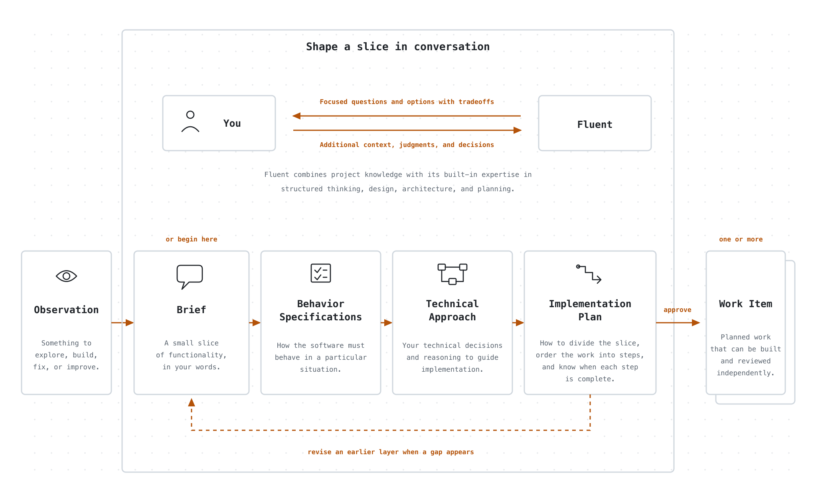

# Fluent – a self improving software factory

Fluent is a factory that autonomously turns your team's vision, ideas, bug reports, user feedback, production logs, and agent traces into working software.

<p align="center">
  <picture>
    <source media="(prefers-color-scheme: dark)" srcset=".github/assets/fluent-at-a-glance-dark.gif">
    <source media="(prefers-color-scheme: light)" srcset=".github/assets/fluent-at-a-glance-light.gif">
    
  </picture>
</p>

You use the factory through the Fluent [skill](https://agentskills.io/) in Codex, Claude Code, Pi, or another coding agent that supports skills. The skill turns your conversation into Fluent's interface and drives its command-line machinery for you.

### Install

```bash
npx skills add mrinalwadhwa/fluent --skill fluent  # currently macOS only
```

Use the command above to install the Fluent skill. Start your coding agent in the project folder you want Fluent to work on, then ask it to use Fluent and describe what you want to explore, build, fix, or improve.

The first invocation sets up Fluent for that project and starts shaping the work with you. You can also invoke the skill explicitly: `$fluent` in Codex, `/fluent` in Claude Code, or `/skill:fluent` in Pi.

## How Fluent works

Fluent separates work that needs human attention from work agents can do on their own. You can think of it as two conceptual queues. The first queue waits for people with the right context, judgment, expertise, or authority. The second waits on both compute and agent capacity: a suitable environment with the models, tools, and hardware the work needs, and room to run an agent within subscription, rate, and budget limits.

<p align="center">
  <picture>
    <source media="(prefers-color-scheme: dark)" srcset=".github/assets/fluent-overall-flow-dark.png">
    <source media="(prefers-color-scheme: light)" srcset=".github/assets/fluent-overall-flow-light.png">
    
  </picture>
</p>

Whenever you encounter something to explore, build, fix, or improve, ask Fluent to record it as an Observation. Add whatever context you have in the moment; you do not need to know the solution or have worked out every detail. Agents and connected systems can record Observations too. You can return to any Observation later and refine it on your own timeline, bringing in someone with the right expertise or authority when needed.

When you want to act on an Observation, ask Fluent to shape it into a Work Item, then ask it to run the Work Item. The Work Item waits until suitable agent and compute capacity is available. If its Attempt needs human context or a decision, Fluent places the question in the human queue and releases the capacity it was using, allowing other ready Work to continue.

## How you tell Fluent what to build

Ask Fluent to help shape what you want to build. You can start from an Observation you recorded earlier or begin directly with a Brief. Fluent reads the relevant project code along with the reusable conventions, constraints, and lessons captured as project Expertise.

You do not need to arrive with a finished specification. Fluent collaborates with you as the slice takes shape. It grounds the conversation in the code and project Expertise, checks that it understands what you mean, and asks one focused question at a time. It uses structured methods for problem framing, behavior design, architecture, and planning to challenge assumptions, find missing cases, research technical choices, and present options with their tradeoffs. You provide context and judgment and make each decision.

The conversation produces four layers of shared context:

**Brief.** A Brief describes one small slice of functionality. Fluent is designed to help you turn that slice into working software without first specifying the entire system. The Brief captures, in your words, what you want and why, grounded in the relevant project context. It keeps constraints, assumptions, and unknowns explicit without choosing a solution.

**Behavior Specifications.** A Behavior Specification precisely describes how the software must behave in a particular situation. It is written so the specified observable behavior can be verified without prescribing its implementation.

For the slice described in the Brief, Fluent reads the project’s existing Behavior Specifications and relevant code to understand what the software already guarantees. It then works with you to define the additions, changes, or removals needed for that slice. The result is a behavior diff, not a restatement of the entire system. If the project has no existing Behavior Specifications, the first slice starts them.

Before writing Behavior Specifications, Fluent makes the important terms precise and maps the people and systems involved, the events that occur, and the states that matter. For a small slice, it considers only what changes. It works through one area at a time, proposing a few core behaviors before asking about gaps and important edge cases. If Fluent derives a behavior that was not stated in the Brief, it labels the behavior as derived so you can accept or reject it. Decisions about libraries, protocols, storage, and other solution choices wait for the Technical Approach.

Fluent writes each Behavior Specification in a consistent form that names the situation and the required response. For example:

```text
WHEN a user selects Save on a draft,
THE SYSTEM SHALL show a `Saved` status beside the draft title.
Test: tests/drafts.spec.ts (shows_saved_status_after_save)
```

It describes something a person can observe and a test can verify, without choosing a UI framework, component structure, or persistence mechanism.

Fluent writes Behavior Specifications in EARS, the Easy Approach to Requirements Syntax. EARS uses a small set of patterns that make the triggering event or condition and the required response explicit.

Every new behavior includes either a `Test:` reference or an `Untestable:` reason. While defining the behavior, Fluent inspects nearby tests and names the intended test in the project’s existing style. The test usually does not exist yet. The Writer creates it during implementation and the Tester runs it. When the test passes, the Behavior Reviewer uses that as evidence that the behavior was delivered.

**Technical Approach.** The Technical Approach document captures your technical expertise and judgment before the work is delegated to agents. You and Fluent decide the key technical choices that should guide implementation, including structure, interfaces, protocols, libraries, storage, and integrations. The document gives the Writer both the decisions and the reasoning behind them, while leaving implementation details that agents can safely determine during the work.

**Implementation Plan.** The Implementation Plan turns the confirmed behaviors and technical decisions into work that agents can carry out. You and Fluent decide whether the slice should become one Work Item or several independently reviewable Work Items that can run in parallel. Each Work Item is divided into steps that state what will become observably true, which behaviors the step delivers, and how the result will be verified. Fluent orders those steps by what must be built first. When Work Items depend on one another, the plan pins the interfaces they share and the points at which their work must come together.

You confirm each layer before Fluent uses it as the foundation for the next. The conversation can also move backward. If the Technical Approach reveals missing behavior, you return to the Behavior Specifications. If the Implementation Plan exposes an unresolved technical decision, you return to the Technical Approach rather than leaving the Writer to guess.

<p align="center">
  <picture>
    <source media="(prefers-color-scheme: dark)" srcset=".github/assets/how-you-tell-fluent-dark.png">
    <source media="(prefers-color-scheme: light)" srcset=".github/assets/how-you-tell-fluent-light.png">
    
  </picture>
</p>

When you confirm the Implementation Plan, Fluent creates one Work Item for each independently reviewable part of the slice. Each Work Item carries the approved Brief, Behavior Specifications, Technical Approach, and the part of the Plan its agents must deliver. Creating a Work Item records the handoff. It does not start an agent or place the Work Item in the agent queue.

Ask Fluent to run a Work Item directly, or add it to the queue to wait for agent and compute capacity. Running it creates an Attempt, a durable record of one path through writing, testing, reviewing, and learning. Separate Work Items can proceed independently while the dependent steps inside each Attempt remain ordered.

## How Fluent builds it

The Writer receives the approved planning context, the relevant project code and Expertise, and the instructions that apply to the files it will change. It works in an isolated Git worktree, writes the code and tests, and commits its candidate. The Attempt can run in a local sandbox or on a remote Fargate machine. Only the delegated work moves to that environment; questions still return to the human queue.

The Tester is a deterministic program rather than another coding agent. It runs the commands declared by the project, captures their output, and turns it into one structured test artifact. This gives every reviewer the same evidence and connects the `Test:` references in the Behavior Specifications to the tests that were actually run.

Five reviewers inspect the same candidate through independent lenses:

- The Behavior Reviewer checks whether the change delivers the specified observable behavior.
- The Architecture Reviewer checks the structure and technical decisions.
- The Tests Reviewer checks the quality and coverage of the tests.
- The Documentation Reviewer checks the documentation against the code and the project’s writing standards.
- The Skills Reviewer checks any Agent Skills that the change adds or modifies.

The reviewers run in parallel after the Tester finishes. Each returns `pass`, `fail`, or `uncertain` and writes the evidence behind that verdict. A failing review or a test regression sends its findings back to the Writer. The Writer revises the candidate, then the Tester and the relevant reviewers check the new commit. An uncertain verdict, a consequential decision outside the approved context, or a loop that stops making progress places the Attempt in the human queue with the evidence collected so far.

When the Tester and all reviewers pass, the Learner examines the completed change and the evidence from every round. The Attempt produces a ready Merge Candidate only after the Learner succeeds. If the Work Item came through the scheduler, its agent and compute capacity is released at this point. The scheduler never lands the candidate.

### Land the Merge Candidate

A ready Merge Candidate is the reviewed result of the Attempt, including any Expertise the Learner added. It has not changed the target branch. Ask Fluent to show you the candidate and inspect the change before accepting it. The default workflow waits for your acceptance; Fluent also provides a separate opt-in auto-merge process for projects that want ready candidates landed without an individual approval.

During land, Fluent checks that the candidate and target worktrees are clean, updates the candidate against the current target branch, and runs the project’s `check-pre-merge` hook when one is configured. A project can also provide a `fix-pre-merge` hook to make a project-defined correction after a failed check and run the check again. If a rebase conflict cannot be resolved or a check still fails, Fluent stops without moving the target branch. When the gate passes, Fluent fast-forwards the target branch to the resulting commit.

## How Fluent keeps improving your code

Fluent uses different feedback loops for findings that belong to the current candidate and findings that should become later Work. Tester regressions and failing reviews stay inside the current Attempt and return to the Writer. The Learner records other findings in a handoff, but Fluent does not add them to the project’s Observation backlog unless the original candidate lands.

After land, every Learner follow-up becomes an Observation linked to the Work Item, Attempt, Merge Candidate, and merged commit that produced it. The follow-up can also produce a corrective Work Item when it states a complete expected result and deterministic verification, names what is in and out of scope and the files it may change, leaves no decision unresolved, and is grounded in an existing Behavior Specification, an applicable project instruction, or project Expertise. If any of that context is missing or stale, the finding remains only an Observation for you to shape later.

In the default `propose` mode, derived corrective Work waits for you to authorize it. In `execute` mode, Fluent can authorize and queue it automatically within the project’s configured follow-up limit. Both modes use the same Writer, Tester, Reviewer, and Learner loop. Queuing Work does not start the scheduler, and neither the scheduler nor follow-up authorization lands the resulting Merge Candidate.

You can also opt into a post-merge review when you land a candidate. After a short debounce period, Fluent runs the Tester and five reviewers against the landed change. A failing or uncertain review starts a forward-fix Attempt through the normal build loop. That Attempt can produce another ready Merge Candidate, but it cannot land the candidate by itself.

## How Fluent learns your project

Expertise is Fluent’s project-local, versioned memory. It is not training data for the underlying model. It lives under `.fluent/expertise/` and records project-level conventions, architectural constraints, testing patterns, and gotchas that future agents should know.

The Learner receives the complete change and the Tester and reviewer artifacts from every round. In the default `capture` mode, it may refine Expertise or leave it unchanged when the Attempt taught it nothing reusable. Fluent confines those writes to `.fluent/expertise/` and records the complete Expertise change in a single `Update expertise` commit. The Learner cannot modify project source, documentation, Observations, or Work state.

If a Work Item must preserve one exact reviewed commit, it can use `no-expertise` mode. The Learner still audits the change and identifies follow-ups, but it cannot write Expertise or change the candidate commit. This mode must be selected before Fluent creates the Work Item, and its Attempt runs locally rather than on Fargate.

Expertise changes become part of the Merge Candidate, so they land with the code that taught them. Future shaping conversations, Writers, and Reviewers can read the relevant Expertise instead of rediscovering the same project knowledge. You can inspect and edit it when a convention changes or an earlier lesson is wrong.

The Learner also identifies possible follow-ups. After land, Fluent decides which remain only Observations and which also qualify as corrective Work. Follow-up Work changes what Fluent does next. Expertise changes how Fluent approaches future Work. A Learner failure keeps the Merge Candidate from becoming ready. When the failure is retryable, rerunning the Attempt retries only the Learner rather than rerunning the Writer, Tester, and reviewers.
